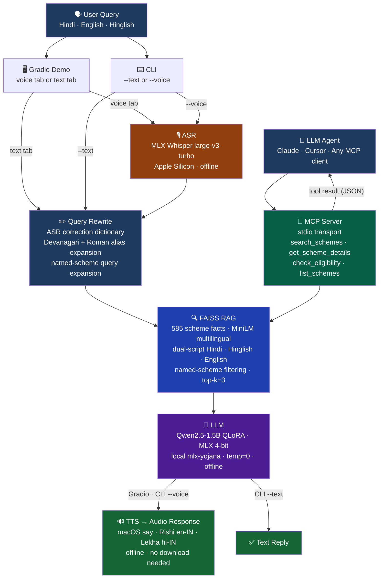

# 🇮🇳 Yojana Sahayak — Offline Voice Agent for Indian Government Schemes

A **fully offline, multilingual AI assistant** that helps Indian citizens discover and understand government welfare schemes in Hindi, English, and Hinglish. Runs entirely on-device — no cloud APIs, no internet required for inference.

**Three ways to use it:**
- 🖥️ **Gradio web demo** — browser-based voice + text UI with pipeline progress and TTS
- 🔧 **CLI** — quick text or voice queries from the terminal
- 🤖 **MCP server** — tool-calling integration for agentic AI systems (Claude, Cursor, etc.)



## Why It Exists

600M+ Indians are eligible for government welfare schemes but can't navigate them — language barriers, digital literacy gaps, and bureaucratic complexity. Yojana Sahayak is a voice-first AI that speaks Hindi, runs in the browser, and answers questions about 2,872+ schemes instantly — entirely offline on Apple Silicon.

---

## Offline Stack

| Component | Model / Engine | Runtime |
|-----------|---------------|---------|
| ASR | `mlx-community/whisper-large-v3-turbo` | MLX (Apple Silicon) |
| LLM | `mlx-yojana/` — Qwen2.5-1.5B QLoRA, 4-bit quantized | MLX (Apple Silicon) |
| TTS Hindi | macOS `say -v Lekha` (hi-IN, Apple Neural) | System — no download |
| TTS English/Hinglish | macOS `say -v Rishi` (en-IN, Indian accent) | System — no download |
| Embeddings | `paraphrase-multilingual-MiniLM-L12-v2` | sentence-transformers |
| Vector Search | FAISS IndexFlatIP | faiss-cpu |

All models run fully offline after initial setup. No API keys needed.

---

## Quick Start

### Step 0 — One-time model setup (Apple Silicon required)

```bash
git clone https://github.com/Subh24ai/yojana-sahayak.git
cd yojana-sahayak

# Create and activate virtual environment
python -m venv .v2env && source .v2env/bin/activate

# Install all dependencies
pip install -e ".[demo,mcp]"
pip install mlx-whisper mlx-lm sounddevice scipy soundfile parler-tts

# Convert fine-tuned model to MLX 4-bit format (one time, ~3 min, needs ~4 GB disk)
python scripts/setup_mlx_model.py
```

After this, `mlx-yojana/` (~851 MB) is used for all inference — no further downloads needed.

> **Without this step** the pipeline falls back to the HuggingFace merged model (downloaded on first inference, ~1 GB) and prints a warning. Quality is the same; startup is slower on first run.

### Option 1 — Gradio Web Demo

```bash
source .v2env/bin/activate
python -m yojana_sahayak.cli --gradio
# Open http://127.0.0.1:7860
```

The demo includes:
- **Voice tab** — record mic, press Ask, get audio response with word-by-word highlighting
- **Text tab** — example scheme chips, type or click to query
- **Pipeline progress** — animated stage indicator (ASR → Rewrite → RAG → LLM → TTS)
- **Latency cards** — color-coded per-stage timing (green < 2s, yellow 2–5s, red > 5s)

### Option 2 — Text Query (CLI)

```bash
python -m yojana_sahayak.cli --text "PM Kisan ke liye kaun eligible hai?"
```

### Option 3 — Voice Query (CLI)

```bash
python -m yojana_sahayak.cli --voice
```

### Option 4 — MCP Server (for agentic AI)

```bash
python -m yojana_sahayak.mcp.server
# or: yojana-mcp
```

---

## How the Pipeline Works

```
User speaks / types
      ↓
[MLX Whisper]  →  transcript  (WER 24%, RTF 0.37 on M4 Air)
      ↓
[Query Rewrite]  →  ASR corrections + Devanagari/Hinglish alias expansion
      ↓
[FAISS RAG]  →  top-3 scheme facts from 585 indexed docs
                (Hindi · Hinglish · English — dual-script search)
      ↓
[Qwen2.5-1.5B MLX 4-bit]  →  factual answer in user's language
      ↓
[macOS say — Rishi / Lekha]  →  WAV audio output
```

**RAG strategy**: For named schemes (PM Kisan, Ayushman, Ujjwala etc.) the retriever expands the query with the full scheme name in English and filters results to that scheme only — preventing cross-scheme hallucination. Both Devanagari and Roman aliases are supported.

---

## Environment Variables

No API keys are required to run the demo or CLI. The only optional variable is for private HuggingFace model downloads:

```env
# Optional: HuggingFace token (only if using private model repos)
HF_TOKEN=
```

---

## MCP Server — Tool-Calling for Agentic AI

Exposes government scheme knowledge as tools any LLM agent can invoke via [Model Context Protocol](https://modelcontextprotocol.io/). Uses **stdio transport** — zero network dependency, ideal for air-gapped environments.

### Available Tools

| Tool | Description |
|------|-------------|
| `search_schemes` | Semantic search over 585 scheme facts |
| `get_scheme_details` | Get specific scheme info by name and field |
| `check_eligibility` | Check eligibility criteria for a scheme |
| `list_schemes` | List all indexed scheme names |

### Add to Claude Desktop / Cursor

```json
{
  "mcpServers": {
    "yojana-sahayak": {
      "command": "python",
      "args": ["-m", "yojana_sahayak.mcp.server"],
      "cwd": "/path/to/yojana-sahayak"
    }
  }
}
```

---

## Benchmarks

| Component | Metric | Value | Hardware |
|-----------|--------|-------|----------|
| ASR (Whisper MLX) | WER Hindi | **24%** | Apple M4 Air |
| ASR (Whisper MLX) | RTF | **0.37** (2.7× real-time) | Apple M4 Air |
| LLM (QLoRA) | Perplexity | **1.15** | Kaggle T4 |
| LLM (QLoRA) | Eval loss | **0.2076** | — |
| RAG (FAISS) | Index size | **585 facts** | — |
| RAG | Hindi query accuracy | **✓ correct scheme** | cross-script alias expansion |
| Dataset | Total pairs | **39,957** (EN + HI) | — |
| Dataset | Schemes covered | **2,872** | myscheme.gov.in |
| E2E Pipeline | Latency (MLX 4-bit) | **~15–20s** | Apple M4 Air |
| LLM model size | Disk | **851 MB** (4-bit) vs 3.09 GB (FP16) | — |

---

## Project Structure

```
yojana-sahayak/
├── yojana_sahayak/
│   ├── config.py                # Centralized config — models, RAG thresholds, aliases
│   ├── cli.py                   # CLI: --text --voice --gradio --mcp
│   ├── demo.py                  # Gradio web UI (voice + text tabs, pipeline progress)
│   ├── asr/
│   │   └── whisper.py           # MLX Whisper ASR + ASR correction rewrite (offline)
│   ├── rag/
│   │   └── retriever.py         # FAISS + MiniLM, dual-script Hindi/Hinglish/English search
│   ├── llm/
│   │   └── generator.py         # Qwen2.5-1.5B via MLX 4-bit, noise + repetition filter
│   ├── tts/
│   │   └── speaker.py           # macOS say: Rishi (en-IN Hinglish) + Lekha (hi-IN Hindi)
│   ├── mcp/
│   │   └── server.py            # MCP server (4 tools, stdio transport)
│   ├── agent/
│   │   └── pipeline.py          # End-to-end pipeline orchestrator with latency tracking
│   └── data_pipeline/
│       ├── extract.py           # PDF extraction from myscheme.gov.in
│       └── generate_qa.py       # Bilingual QA pair generation
├── mlx-yojana/                  # Local MLX 4-bit model (851 MB, generated by convert step)
├── tests/
│   └── test_core.py             # Tests: config, ASR rewrite, MCP tools, data quality, TTS
├── data/
│   ├── core_schemes.jsonl       # 16 hand-curated scheme facts (always indexed)
│   ├── train_clean.jsonl        # 31,965 training records (git-ignored, large)
│   └── eval_clean.jsonl         # 7,992 eval records (git-ignored, large)
├── .env                         # Credentials (git-ignored — never commit)
├── Dockerfile                   # Default: Gradio demo on port 7860
├── pyproject.toml               # Entry points: yojana-cli, yojana-mcp
└── requirements.txt
```

---

## Tech Stack

| Layer | Technology |
|-------|-----------|
| Web UI | Gradio (voice + text tabs, word-highlight TTS sync) |
| ASR | MLX Whisper large-v3-turbo (offline, Apple Silicon) |
| Query rewrite | Rule-based ASR correction + Devanagari/Hinglish alias expansion |
| Embeddings | paraphrase-multilingual-MiniLM-L12-v2 |
| Vector search | FAISS IndexFlatIP + dual-script named-scheme filtering |
| LLM | Qwen2.5-1.5B QLoRA, MLX 4-bit quantized (offline, local) |
| TTS | macOS `say` — Rishi (en-IN) for Hinglish, Lekha (hi-IN) for Hindi |
| Tool protocol | MCP stdio transport |
| Deployment | Docker (port 7860) |
| Data source | myscheme.gov.in (2,872 schemes) |

---

## Training & Data

### Dataset: [Subh24ai/yojana-sahayak-instruct](https://huggingface.co/datasets/Subh24ai/yojana-sahayak-instruct)

- **Source:** 723 PDFs from myscheme.gov.in covering 2,872 schemes
- **Output:** 39,957 bilingual instruction-tuning pairs (EN + HI/Hinglish)
- **Fields:** description, eligibility, benefits, application_process, multi-turn

### Model: [Subh24ai/yojana-sahayak-qwen2.5-1.5b-qlora](https://huggingface.co/Subh24ai/yojana-sahayak-qwen2.5-1.5b-qlora)

- **Base:** Qwen/Qwen2.5-1.5B-Instruct
- **Method:** QLoRA (4-bit NF4, r=16, α=32)
- **Training:** 10,000 samples, Kaggle T4, 54 minutes
- **Inference:** converted to MLX 4-bit via `mlx_lm.convert` → `mlx-yojana/`
- **Results:** Perplexity 1.15 · Eval loss 0.2076

---

## Testing

```bash
pytest tests/ -v
```

---

## Links

- **Dataset:** [huggingface.co/datasets/Subh24ai/yojana-sahayak-instruct](https://huggingface.co/datasets/Subh24ai/yojana-sahayak-instruct)
- **Model (QLoRA):** [huggingface.co/Subh24ai/yojana-sahayak-qwen2.5-1.5b-qlora](https://huggingface.co/Subh24ai/yojana-sahayak-qwen2.5-1.5b-qlora)
- **Model (merged):** [huggingface.co/Subh24ai/yojana-sahayak-qwen2.5-1.5b-merged](https://huggingface.co/Subh24ai/yojana-sahayak-qwen2.5-1.5b-merged)
- **Author:** [Subhash Gupta](https://linkedin.com/in/subhash24gupta) · [GitHub](https://github.com/Subh24ai)

## License

Apache 2.0. Government scheme data from India's public [MyScheme](https://www.myscheme.gov.in) portal.
