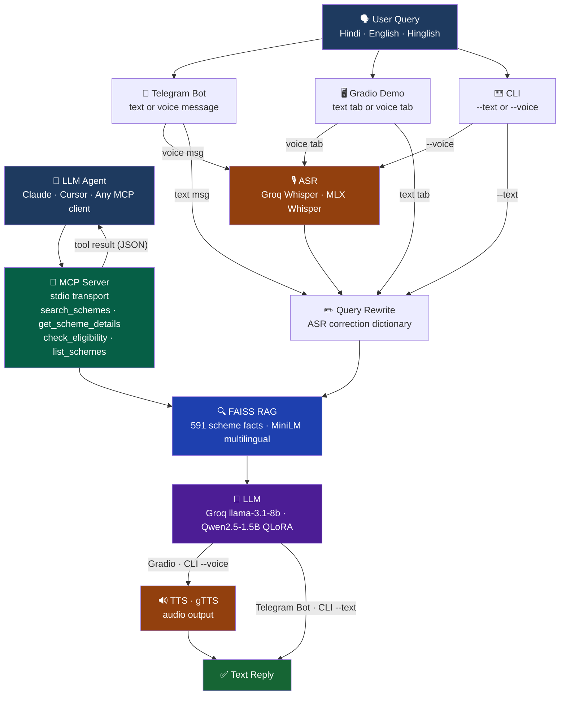

# 🇮🇳 Yojana Sahayak — Voice Agent for Indian Government Schemes

A **multilingual AI assistant** that helps Indian citizens discover and understand government welfare schemes in Hindi, English, and Hinglish.

**Three ways to use it:**
- 🤖 **Telegram bot** — most accessible, works on any phone
- 🖥️ **Gradio web demo** — browser-based voice + text UI
- 🔧 **MCP server** — tool-calling integration for agentic AI systems



## Why It Exists

600M+ Indians are eligible for government welfare schemes but can't navigate them — language barriers, digital literacy gaps, and bureaucratic complexity. Yojana Sahayak is a voice-first AI that speaks Hindi, runs on Telegram (where people already are), and answers questions about 2,872+ schemes instantly.

---

## Quick Start

### Option 1 — Telegram Bot (recommended, cloud)

```bash
git clone https://github.com/Subh24ai/yojana-sahayak.git
cd yojana-sahayak
pip install -e ".[bot]"

# Set your credentials in .env
cp .env.example .env   # then fill in TELEGRAM_BOT_TOKEN and GROQ_API_KEY

python -m yojana_sahayak.bot.telegram_bot
# or: yojana-bot
# or: make bot
```

The bot starts in **polling mode** by default (no server needed for dev). For production, set `WEBHOOK_URL` and it switches to webhook mode automatically.

### Option 2 — Gradio Web Demo (local)

```bash
pip install -e ".[demo,groq]"
python -m yojana_sahayak.cli --gradio
# Open http://localhost:7860
```

### Option 3 — Text Query (CLI)

```bash
pip install -e .
python -m yojana_sahayak.cli --text "PM Kisan ke liye kaun eligible hai?"
```

### Option 4 — MCP Server (for agentic AI)

```bash
pip install -e ".[mcp]"
python -m yojana_sahayak.mcp.server
# or: yojana-mcp
```

---

## Telegram Bot Features

| Feature | Details |
|---------|---------|
| `/start` `/help` | Welcome message with usage examples |
| `/schemes` | Inline keyboard: tap any of 10 popular schemes |
| Per-scheme buttons | Eligibility · Benefits · How to Apply · About |
| `/clear` | Reset conversation history |
| Text messages | Full RAG + LLM pipeline, 5-turn memory |
| Voice messages | ASR → RAG → LLM → text reply |
| Languages | Hindi · English · Hinglish |
| Rate limiting | 10 messages/minute per user |
| Deployment | Polling (dev) or Webhook (production) |

---

## Environment Variables

Copy `.env.example` to `.env` and fill in:

```env
# Required for Telegram bot
TELEGRAM_BOT_TOKEN=your_bot_token_from_botfather

# Required for cloud LLM + ASR (free tier available at console.groq.com)
GROQ_API_KEY=your_groq_api_key

# Optional: production webhook URL (e.g. from Railway / Render / Fly.io)
WEBHOOK_URL=https://your-app.railway.app

# Optional: override the Groq model (default: llama-3.1-8b-instant)
GROQ_MODEL=llama-3.1-8b-instant

# Optional: AI4Bharat Bhashini TTS for higher-quality Hindi voice
AI4BHARAT_API_KEY=your_bhashini_api_key
```

Get a free Telegram bot token: [@BotFather](https://t.me/BotFather)
Get a free Groq API key: [console.groq.com](https://console.groq.com)

---

## LLM Backend Selection

The system auto-selects the LLM at runtime:

| Condition | Backend used |
|-----------|-------------|
| `GROQ_API_KEY` is set | Groq `llama-3.1-8b-instant` — fast, works anywhere |
| No Groq key, Apple Silicon | Fine-tuned Qwen2.5-1.5B via MLX |

The same logic applies to ASR: Groq Whisper API when the key is set, MLX Whisper locally otherwise.

---

## MCP Server — Tool-Calling for Agentic AI

Exposes government scheme knowledge as tools any LLM agent can invoke via [Model Context Protocol](https://modelcontextprotocol.io/). Uses **stdio transport** — zero network dependency, ideal for air-gapped environments.

### Available Tools

| Tool | Description |
|------|-------------|
| `search_schemes` | Semantic search over 591+ scheme facts |
| `get_scheme_details` | Get specific scheme info by name and field |
| `check_eligibility` | Check eligibility criteria for a scheme |
| `list_schemes` | List all indexed scheme names |

### Add to Claude Desktop / Cursor

```json
{
  "mcpServers": {
    "yojana-sahayak": {
      "command": "python",
      "args": ["-m", "yojana_sahayak.mcp.server"],
      "cwd": "/path/to/yojana-sahayak"
    }
  }
}
```

---

## Deployment

### Docker (recommended for production)

```bash
# Build
docker build -t yojana-sahayak .

# Run Telegram bot
docker run --env-file .env -p 8000:8000 yojana-sahayak

# Run Gradio demo
docker run --env-file .env -p 7860:7860 yojana-sahayak \
    python -m yojana_sahayak.cli --gradio

# Run MCP server (air-gapped)
docker run --env-file .env yojana-sahayak \
    python -m yojana_sahayak.mcp.server
```

### Railway / Render / Fly.io

1. Connect your GitHub repo
2. Set environment variables: `TELEGRAM_BOT_TOKEN`, `GROQ_API_KEY`, `WEBHOOK_URL`
3. Deploy — the bot starts automatically in webhook mode

---

## Benchmarks

| Component | Metric | Value | Hardware |
|-----------|--------|-------|----------|
| ASR (Whisper MLX) | WER Hindi | **24%** | Apple M4 Air |
| ASR (Whisper MLX) | RTF | **0.37** (2.7× real-time) | Apple M4 Air |
| LLM (QLoRA) | Perplexity | **1.15** | Kaggle T4 |
| LLM (QLoRA) | Eval loss | **0.2076** | — |
| RAG (FAISS) | Index size | **591 facts** | — |
| Dataset | Total pairs | **39,957** (EN + HI) | — |
| Dataset | Schemes covered | **2,872** | myscheme.gov.in |
| E2E Pipeline | Latency (Groq) | **~2–3s** | Any machine |
| E2E Pipeline | Latency (MLX) | **~12s** | Apple M4 Air |

---

## Project Structure

```
yojana-sahayak/
├── yojana_sahayak/
│   ├── config.py                # Centralized config, loads .env
│   ├── cli.py                   # CLI: --text --voice --gradio --bot --mcp
│   ├── demo.py                  # Gradio web UI
│   ├── asr/
│   │   ├── whisper.py           # MLX Whisper ASR + query rewrite
│   │   └── groq_asr.py          # Groq Whisper API (cloud, any format)
│   ├── rag/
│   │   └── retriever.py         # FAISS + MiniLM multilingual retriever
│   ├── llm/
│   │   ├── generator.py         # Auto-selects Groq or MLX at runtime
│   │   └── groq_generator.py    # Groq cloud LLM (llama-3.1-8b-instant)
│   ├── tts/
│   │   └── speaker.py           # gTTS synthesis + language detection
│   ├── bot/
│   │   └── telegram_bot.py      # Telegram bot (text + voice + inline keyboards)
│   ├── mcp/
│   │   └── server.py            # MCP server (4 tools, stdio transport)
│   ├── agent/
│   │   └── pipeline.py          # End-to-end pipeline orchestrator
│   └── data_pipeline/
│       ├── extract.py           # PDF extraction from myscheme.gov.in
│       └── generate_qa.py       # Bilingual QA pair generation
├── tests/
│   └── test_core.py             # 15 tests: config, ASR, MCP tools, data, TTS
├── data/
│   ├── core_schemes.jsonl       # Curated scheme facts (indexed at startup)
│   ├── train_clean.jsonl        # 31,965 training records (git-ignored, large)
│   └── eval_clean.jsonl         # 7,992 eval records (git-ignored, large)
├── .env                         # Credentials (git-ignored — never commit)
├── Dockerfile                   # Default: Telegram bot; supports all modes
├── Makefile                     # make bot / demo / mcp / query / test
├── pyproject.toml               # Entry points: yojana-bot, yojana-cli, yojana-mcp
└── requirements.txt
```

---

## Tech Stack

| Layer | Technology |
|-------|-----------|
| Telegram bot | python-telegram-bot v20 (async) |
| ASR (cloud) | Groq Whisper large-v3-turbo |
| ASR (local) | mlx-community/whisper-large-v3-turbo |
| Embeddings | paraphrase-multilingual-MiniLM-L12-v2 |
| Vector search | FAISS IndexFlatIP (cosine similarity) |
| LLM (cloud) | Groq llama-3.1-8b-instant |
| LLM (local) | Qwen2.5-1.5B-Instruct + QLoRA (MLX) |
| TTS | gTTS |
| Tool protocol | MCP stdio transport |
| Deployment | Docker, Railway/Render/Fly.io |
| Data source | myscheme.gov.in (2,872 schemes) |

---

## Training & Data

### Dataset: [Subh24ai/yojana-sahayak-instruct](https://huggingface.co/datasets/Subh24ai/yojana-sahayak-instruct)

- **Source:** 723 PDFs from myscheme.gov.in covering 2,872 schemes
- **Output:** 39,957 bilingual instruction-tuning pairs (EN + HI/Hinglish)
- **Fields:** description, eligibility, benefits, application_process, multi-turn

### Model: [Subh24ai/yojana-sahayak-qwen2.5-1.5b-qlora](https://huggingface.co/Subh24ai/yojana-sahayak-qwen2.5-1.5b-qlora)

- **Base:** Qwen/Qwen2.5-1.5B-Instruct
- **Method:** QLoRA (4-bit NF4, r=16, α=32)
- **Training:** 10,000 samples, Kaggle T4, 54 minutes
- **Results:** Perplexity 1.15 · Eval loss 0.2076

---

## Testing

```bash
pytest tests/ -v   # 15 tests, all passing
```

---

## Links

- **Dataset:** [huggingface.co/datasets/Subh24ai/yojana-sahayak-instruct](https://huggingface.co/datasets/Subh24ai/yojana-sahayak-instruct)
- **Model:** [huggingface.co/Subh24ai/yojana-sahayak-qwen2.5-1.5b-qlora](https://huggingface.co/Subh24ai/yojana-sahayak-qwen2.5-1.5b-qlora)
- **Author:** [Subhash Gupta](https://linkedin.com/in/subhash24gupta) · [GitHub](https://github.com/Subh24ai)

## License

Apache 2.0. Government scheme data from India's public [MyScheme](https://www.myscheme.gov.in) portal.
